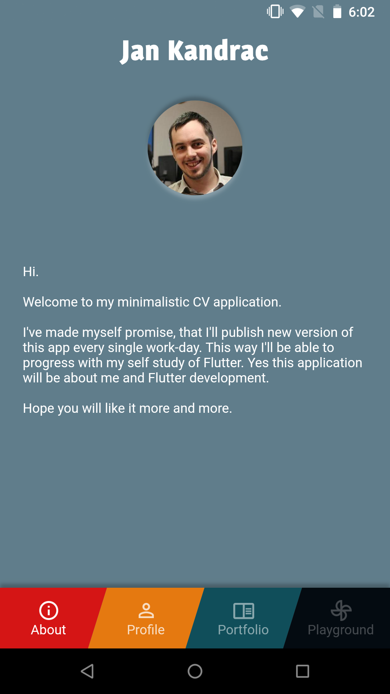

# My Curriculum application

I have tendency to over-complicate things or, as some says, I'm perfectionist (God I hate that
word). Especially when I'm working on my own projects. This curriculum application should be MVP
application made in one day, so that later I can add more and more features into it.

This should keep me motivated and keep you tuned with more and more new things I'll learn along
the way. I'll update README as well so that you can keep track of used technologies. You will
also find links to files meant for "skill presentation purposes" here.

## Screens

|                                                                       |                                                                        |                                                                           |
|-----------------------------------------------------------------------|------------------------------------------------------------------------|---------------------------------------------------------------------------|
|   |   |    |

## Used technologies and libraries (so far)

You can simply find used libraries in [pubspec.yaml](./pubspec.yaml) file. I'll just simply describe
them here

### Design

1. [google_fonts](https://pub.dev/packages/google_fonts) - to make use of all available google fonts
2. [flutter_neumorphic](https://pub.dev/packages/flutter_neumorphic) - to use cool Neumorphic views.
Raised neumorphic views doesn't "float" as raised materials but elevate along with background making
illusion of continuity.

### Architecture

So far no architecture components are used, but I was working with BLoC pattern at it simply touched
my heart (in right way). It reminds me of my understanding of MVVM pattern and is widely recommended
by community.

### Samples

[TextLogo](lib/ui/widget/text_logo.dart) Extremely simple Widget, that shows extension of
`StatelessWidget`

## ToDo

Here only close ToDos will be written down

1. Try to play around with PageRouteBuilder.transitionBuilder on `SplashPage` so that I can remove
opacity animations on `LandingPage`
